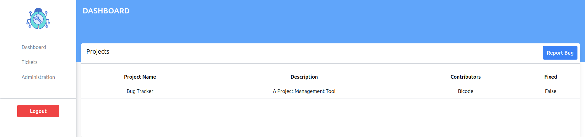

<h3>This is an <a href="https://appwrite.io/">Appwrite</a> Hackathon challenge</h3>
<br />

<h3 style="color: blue">Description</h3>
Bug tracker is a tool that is used within an organizaton to keep track of bugs related to  <br />
their project project

<h3>Installation</h3>
Start by cloning the repo: <br />


```
git clone https://github.com/bismarkboateng/bug-tracker.git
npm run dev
```
<br />
open <a href="http:localhost:5173">http:localhost:5173</a> with your browser to see result
you can start editing the page by modifying <br />
```
src/app.jsx
``` 
<br />
The page auto updates as you edit the file
this project uses vite as it's build tool
<br />
NB: the port may change, After the second command, copy and paste the url into your browser
